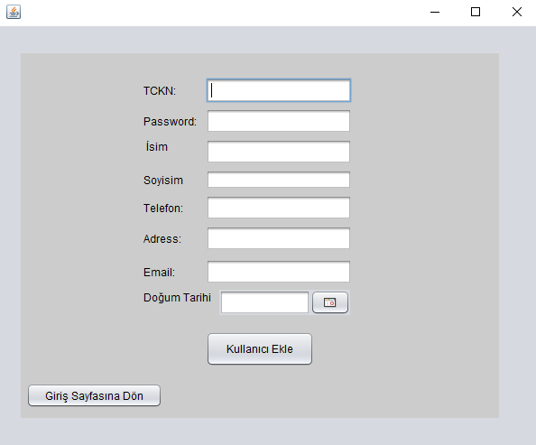

This is a *NetBeans* **Java Swing** Project Connected with **MYSQL** Database

# GUI Pages

 The desktop application I wrote using Java Swing accesses the Database on MYSQL using JDBC and applies (CRUD) Create, Read, Update, Delete operations to the database within the user's authorizations.

## Login Page

Program starts with the Login page when first opened. If you are not a user, you can create an account on the application, if you are a user, according to your ID number, it understands whether you are a **Manager** or **User** and redirects to other windows.

##  Create User 

When you click the Create User button, you are directed to another window. After entering the missing information there, the account is created.

## User Page

After creating an account, you can log in by returning to the login page. When you log in as a user, your upcoming flights are listed on the left. On the right, you can search for another passenger.

#### Search Passengers

#### Flight Search
Or you can list the flights on the specified date by switching from the menu bar.

## Manager Page

If you have access as a Manager, you have 3 options. 
- ### User Info Panel
	>You can see all users in the User Info panel. You can filter, search or delete these users or add users.
	>
- ### Crew Info Panel
	>You can see all aircraft and all cabin crews in the Crew Info panel. You can search for these employees by filtering them.
	>
- ### Query Panel
	>You can send a query to the Database from the Query panel and see the output from the Result section below.
	>
	
# Database Adaptation:

## *Table images taken from MYSQL Workbench:*

### Airplane Table

### Airport Table

### Flight Info Table

### Ticket Table

### User Table

### Seat Table

